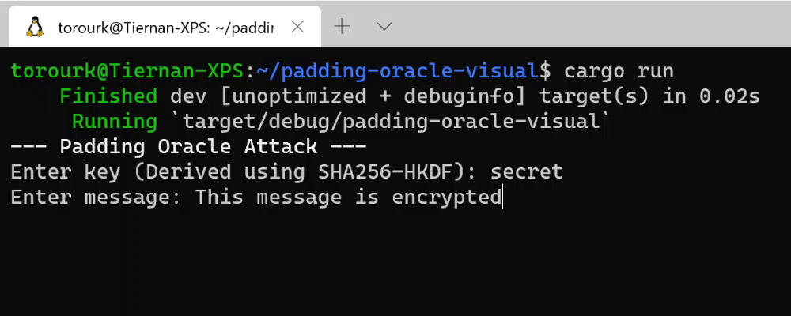

# padding-oracle-visual

An implementation of the [padding oracle attack](https://en.wikipedia.org/wiki/Padding_oracle_attack) for AES-128 in CBC mode.



## Running

To run:
```
cargo run --release
```

The program will prompt for a key and message.
The message will be encrypted using AES-128 in CBC mode.
An adversary will be given the IV and ciphertext along with a padding oracle which it will use to decrypt the message.
The padding oracle will listen for ciphertexts and return whether an error occurred during the decryption of a given ciphertext.

The adversary and padding oracle coexist in the same program in this implementation, but their interaction could easily be adapted to a client-server model.

The decryption is slowed down for visual purposes.
Decryption using this method can happen nearly instantaneously and will most likely be bottlenecked by the connection between the adversary and padding oracle.
